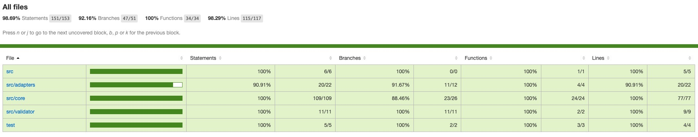

# @hd/cache-strategies

平台无关的缓存策略

## 测试覆盖

[](./coverage/lcov-report/index.html)
[](./coverage/lcov-report/index.html)
[](./coverage/lcov-report/index.html)
[](./coverage/lcov-report/index.html)



## Usage

### 安装

```
 yarn add @hd/cache-strategies
```

### Api

#### cacheStrategy: 缓存策略实例

  ##### useConfig: 更改缓存策略实例的配置

  ```typescript
  interface CacheStrategyConfig {
    // 各个平台用来缓存数据的 存储器
    adapter: Adapter | null;
    // 判断是否需要来缓存数据，
    // true - 需要缓存，false - 不需要缓存
    validateCache?(val: any): boolean | Promise<boolean>;
    // 缓存的key的前缀
    prefix?: string;
    // 此次用来缓存的key，默认会用md5("JSON.stringify(args)_fn.toString()")
    currentSaveKey?: string;
  }
  ```

  ##### staleWhileRevalidate：

  如果可用，则使用缓存响应尽快响应请求；如果没有缓存，则返回到网络请求，然后使用网络请求更新缓存。与某些过时而重新验证的实现不同，此策略将始终发出重新验证请求，而不考虑缓存响应的时间。

  > The stale-while-revalidate pattern allows you to respond to the request as quickly as possible with a cached response if available, falling back to the network request if it’s not cached. The network request is then used to update the cache. As opposed to some implementations of stale-while-revalidate, this strategy will always make a revalidation request, regardless of the age of the cached response.

  

  ##### cacheOnly:

  仅从缓存获得数据，这在工作中不太常见，但如果您有自己的预缓存步骤，这可能会很有用。

  > The cache only strategy ensures that responses are obtained from a cache. This is less common in workbox, but can be useful if you have your own precaching step.

  

  ##### apiOnly:

  如果您需要从 api 满足特定的请求，那么只需使用 apiOnly 策略。

  > If you require specific requests to be fulfilled from the network, the network only is the strategy to use.

  

  ##### cacheFirst:

  如果缓存中有数据，将使用缓存的数据来满足请求，而 api 将完全不使用。如果没有缓存的数据，请求将由 api 请求来满足，数据将被缓存，以便下一个请求直接从缓存中得到服务。

  > If there is a Response in the cache, the Request will be fulfilled using the cached response and the network will not be used at all. If there isn't a cached response, the Request will be fulfilled by a network request and the response will be cached so that the next request is served directly from the cache.

  

  ##### apiFirst:

  对于频繁更新的请求，网络优先策略是理想的解决方案。默认情况下，它将尝试从网络获取最新的响应。如果请求成功，它将把响应放在缓存中。如果网络返回响应失败，将使用缓存的响应。

  > For requests that are updating frequently, the network first strategy is the ideal solution. By default, it will try to fetch the latest response from the network. If the request is successful, it’ll put the response in the cache. If the network fails to return a response, the cached response will be used.

  

##### cacheAndApiRace
##### cacheThenUpdate
##### CacheStrategy Class

## WIP

- [ ] 缓存过期时间?
- [ ] LRU算法?
- [ ] 小程序平台Adapter
- [ ] weex平台Adapter
