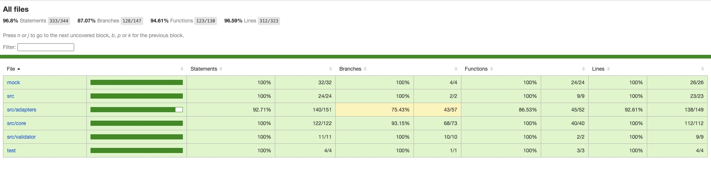
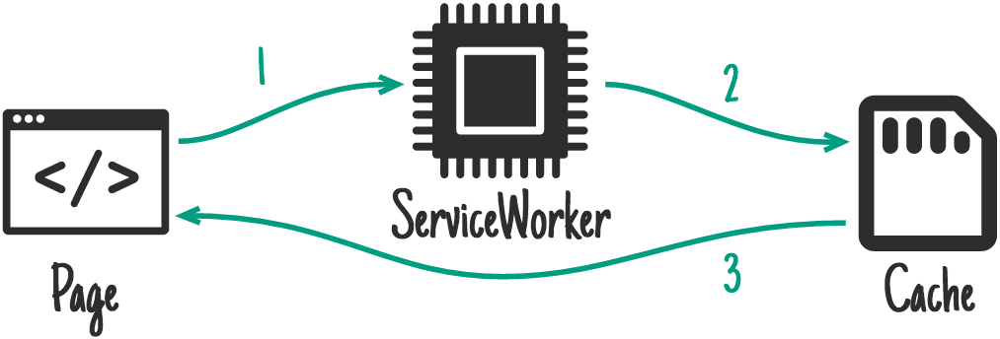

# @hd/cache-strategies

平台无关的缓存策略

## 测试覆盖

[](./coverage/lcov-report/index.html)
[](./coverage/lcov-report/index.html)
[](./coverage/lcov-report/index.html)
[](./coverage/lcov-report/index.html)



## WIP

- [ ] 缓存过期时间?
- [ ] 缓存清理 storage clear
- [ ] 收缩 config 更改范围
- [ ] LRU算法?
- [x] 微信小程序平台Adapter
- [ ] ~~weex平台Adapter~~ 外部实现
- [x] web 平台Adapter
- [ ] nodejs Adapter?
- [x] 内存存储 Adapter，全平台通用，支持LRU

## Usage

### 安装

```
 yarn add @hd/cache-strategies
```

### Api

#### cacheStrategy: 缓存策略实例

  * [staleWhileRevalidate 策略](#staleWhileRevalidate-策略)
  * [cacheFirst 策略](#cacheFirst-策略)
  * [apiFirst 策略](#apiFirst-策略)
  * [cacheAndApiRace 策略](#cacheAndApiRace-策略)
  * [☆☆☆☆☆ cacheThenUpdate 策略](#☆☆☆☆☆ cacheThenUpdate-策略)
  * [cacheOnly 策略](#cacheOnly-策略)
  * [apiOnly 策略](#apiOnly-策略)


> 注：除了 apiFirst 策略会帮您捕获异常，其他策略并不会帮您的方法捕获异常，请自行处理异常情况

  ##### useConfig: 更改缓存策略实例的配置

  ```typescript
  interface CacheStrategyConfig {
    // 各个平台用来缓存数据的 存储器
    adapter: Adapter | null;
    // 判断是否需要来缓存数据，所有缓存进行缓存的时候会经过这个校验，
    // 默认 null, undefined, NaN 将不会被缓存
    // true - 需要缓存，false - 不需要缓存
    validateCache?(val: any): boolean | Promise<boolean>;
    // 缓存的key的前缀
    prefix?: string;
    // 此次用来缓存的key，默认会用md5("JSON.stringify(args)_fn.toString()")
    currentSaveKey?: string;

    // 特殊的一些配置，一般只针对某些策略生效
    // 只针对 cacheThenUpdate 策略生效，当接口调用成功返回数据后，
    // 如果数据符合 `validateCache` 检验的话会回调
    updateCallback?(newVal: any): any
  }

  import cache from "@hd/cache-strategies"
  cache.useConfig(config: Partial<CacheStrategyConfig>)
  ```

  ##### staleWhileRevalidate 策略：

  如果缓存可用，则使用缓存响应尽快响应；如果没有缓存，则返回到api调用，然后使用api调用更新缓存。与某些过时而重新验证的实现不同，此策略将始终会调用api，而不考虑缓存响应的时间。

  > The stale-while-revalidate pattern allows you to respond to the request as quickly as possible with a cached response if available, falling back to the network request if it’s not cached. The network request is then used to update the cache. As opposed to some implementations of stale-while-revalidate, this strategy will always make a revalidation request, regardless of the age of the cached response.

  

  ###### Demo

  ```javascript
    import cache from "@hd/cache-strategies"

    let count = 1;
    function addCount() {
      count += 1;
      return count;
    }
    // 经过 staleWhileRevalidate 包装的方法
    const addCountCache = cacheStrategy.staleWhileRevalidate(addCount);

    // 第一次调用，此时并没有缓存，会直接返回方法返回结果 = 2，count = 2
    const res = await addCountCache();
    console.log(res); // -> 2
    console.log(count); // -> 2
    // 第二次调用，有上一次的缓存，会返回上一次的缓存 = 2
    // 同时会调用方法，使得 count = 3
    const res2 = await addCountCache();
    console.log(res2); // -> 2
    console.log(count); // -> 3
  ```

  > ⚠️ 此策略一般用于数据变动不频繁，不需要那么实时的场景

  ##### cacheFirst 策略:

  如果缓存中有数据，将使用缓存的数据来满足请求，而 api 将完全不调用。如果没有缓存的数据，数据将由 api 调用来满足，数据将被缓存，以便下一个调用直接从缓存中得到数据。

  > If there is a Response in the cache, the Request will be fulfilled using the cached response and the network will not be used at all. If there isn't a cached response, the Request will be fulfilled by a network request and the response will be cached so that the next request is served directly from the cache.

  

  ###### Demo

  ```javascript
    import cache from "@hd/cache-strategies"

    let count = 1;
    function addCount() {
      count += 1;
      return count;
    }

    // 经过 cacheFirst 包装的方法
    const addCountCache = cacheStrategy.cacheFirst(addCount);

    // 第一次调用，并没有缓存，直接返回 api 调用结果并缓存
    const res = await addCountCache();
    console.log(res); // -> 2
    console.log(count); // -> 2
    // 第二次调用，直接从缓存中获取，api并不会被调用
    const res2 = await addCountCache();
    console.log(res); // -> 2
    console.log(count); // -> 2
  ```

  ##### apiFirst 策略:

  对于频繁更新的数据，接口优先策略是理想的解决方案。默认情况下，它将尝试从接口获取最新的数据。如果调用成功，它将把数据放在缓存中。如果接口返回数据失败，将使用缓存的数据。

  > For requests that are updating frequently, the network first strategy is the ideal solution. By default, it will try to fetch the latest response from the network. If the request is successful, it’ll put the response in the cache. If the network fails to return a response, the cached response will be used.

  

  ###### Demo

  ```javascript
    import cache from "@hd/cache-strategies"

    let count = 1;
    function addCount() {
      count += 1;
      if (count >= 3) {
        throw new Error('抛个错')
      }
      return count;
    }

    // 经过 apiFirst 包装的方法
    const addCountCache = cacheStrategy.apiFirst(addCount);

    // 第一次调用，并没有缓存，直接返回 api 调用结果并缓存
    const res = await addCountCache();
    console.log(res); // -> 2
    console.log(count); // -> 2
    // 第二次调用，接口调用失败，降级从缓存中获取
    const res2 = await addCountCache();
    console.log(res); // -> 2
    console.log(count); // -> 3
  ```

  ##### cacheAndApiRace 策略：
  缓存与接口同时调用，哪个优先返回数据就用哪个，同时会缓存此次 api 调用返回的数据

  > 注意：基于 `Promise.any` 实现，但 `Promise.any` 各个平台实现程度不一致，请自行打好补丁

  ###### Demo

  ```javascript
    let count = 1;
    async function addCount() {
      await sleep(1s)
      count += 1;
      return count;
    }

    // 经过 cacheAndApiRace 包装的方法
    const addCountCache = cacheStrategy.cacheAndApiRace(addCount);

    const res = await addCountCache();
    console.log(count); // -> 1
    console.log(res); // -> null
    
    const res2 = await addCountCache();
    console.log(count); // -> 2
    console.log(res); // -> 2
  ```

  ##### ☆☆☆☆☆ cacheThenUpdate 策略：

  如果缓存中有数据，则从缓存中获取数据，并调用接口得到数据并缓存，同时触发回调方法来更新新的数据；
  如果缓存没有数据，则从接口获得数据并缓存；

  ###### Demo

  ```javascript
  let count = 1;
  async function addCount() {
    count += 1;
    return count;
  }

  let fakeFunc2 = jest.fn();
  const addCountCache = cacheStrategy.cacheThenUpdate(addCount, {
    updateCallback: (re) => {
      fakeFunc2(re)
    }
  });

  const res = await addCountCache();
  expect(res).toBe(2);
  expect(count).toBe(2);
  await sleep();
  expect(fakeFunc2).not.toBeCalled();
  const res2 = await addCountCache();
  expect(res2).toBe(2);
  expect(count).toBe(3);
  await sleep();
  expect(fakeFunc2).toBeCalledWith(3);
  ```

  ##### cacheOnly 策略:

  仅从缓存获得数据，这在工作中不太常见，但如果您有自己的预缓存步骤，这可能会很有用。

  > The cache only strategy ensures that responses are obtained from a cache. This is less common in workbox, but can be useful if you have your own precaching step.

  

  ###### Demo

  ```javascript
    import cache from "@hd/cache-strategies"
    let count = 1;
    function addCount() {
      count += 1;
      return count;
    }

    // 经过 cacheOnly 包装的方法
    const addCountCache = cacheStrategy.cacheOnly(addCount);

    const res = await addCountCache()
    console.log(res); // -> null
    console.log(count); // -> 1
  ```

  ##### apiOnly 策略:

  如果您需要从 api 获取特定的数据，那么只需使用 apiOnly 策略。
  
  一般不常用这个策略，因为平时默认就是 api调用 返回数据。

  > If you require specific requests to be fulfilled from the network, the network only is the strategy to use.

  

  ###### Demo

  ```javascript
    let count = 1;
    function addCount() {
      count += 1;
      return count;
    }
  
    // 经过 apiOnly 包装的方法
    const addCountCache = cacheStrategy.apiOnly(addCount);

    const res = await addCountCache();
    console.log(res); // -> 2
    console.log(count); // -> 2
  ```

#### CacheStrategy Class：

缓存策略原始类，你可以自行自定义自己的策略。

## Adapter 更换

工具默认走各个平台的永久缓存，如 web 端的 `localStorage`, 微信小程序端的 `storage`, 工具包暴露了[各个平台的适配器](./src/adapters)，你可以选用合适的适配器以满足需求。

```typescript
import { CacheStrategy, MemoryAdapter } from "@hd/cache-strategies";

// 使用内存缓存
const cacheStrategy = new CacheStrategy({
  adapter: new MemoryAdapter()
});
```

### 自定义 Adapter

如果现有的 `adapter` 不满足您的需求，您可以自定义自己的 `adapter`, 只需实现以下接口:

```typescript
export declare interface Adapter {
  type?: string;
  getItem(key: string): Promise<any> | any;
  setItem(key: string, val: any): Promise<any> | any;
  removeItem(key: string): Promise<void> | any;
}
```

> 可参考[各个平台的适配器](./src/adapters)的写法